Implementation of AWS Auto Scaling with Load Balancer

# AWS Auto Scaling with Load Balancer

## Introduction

This project implements **AWS Auto Scaling** with an **Application Load Balancer (ALB)** to automatically manage EC2 instances based on traffic demand. The system scales up during high traffic and scales down during low traffic, ensuring high availability and cost optimization.

### Key Components:
- **EC2 Instances**: Virtual servers running the application
- **Auto Scaling Group (ASG)**: Automatically adjusts instance count
- **Application Load Balancer (ALB)**: Distributes traffic across instances
- **Launch Template**: Defines instance configuration
- **CloudWatch**: Monitors metrics and triggers scaling

---

## Step 1: Launch Template Setup

Created a **Launch Template** with:
- Custom AMI with application pre-installed
- Instance type: t2.micro
- Security group: HTTP (80) and SSH (22) access
- User data script to auto-start web server

**Purpose**: Launch Template ensures all instances have identical configurations.

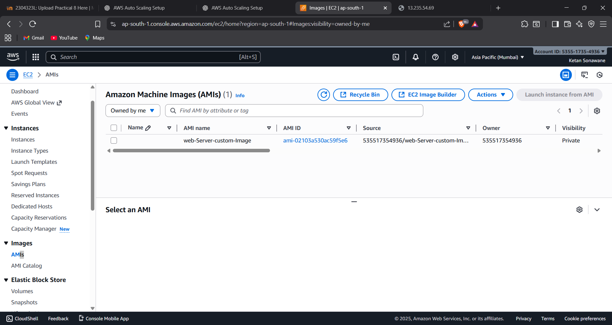
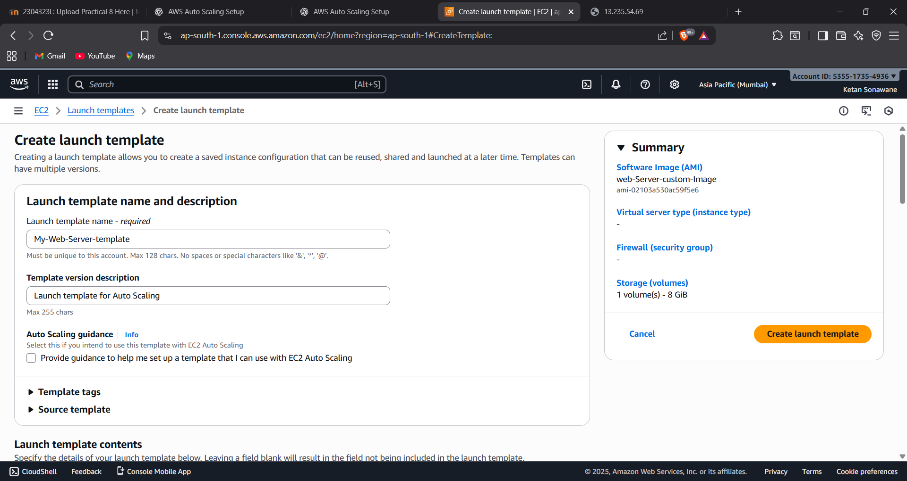

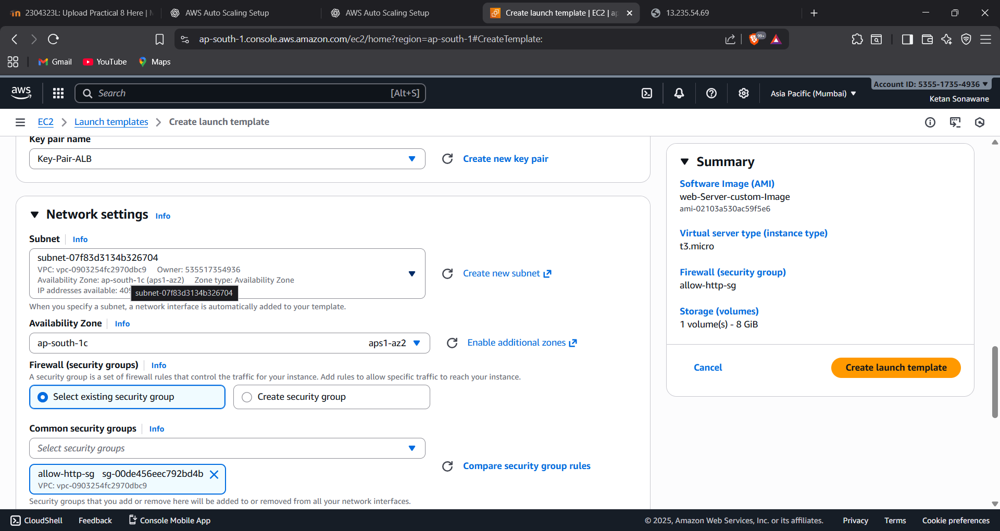


---

## Step 2: Auto Scaling Group (ASG)

Configured ASG with:
- **Minimum**: 1 instance
- **Desired**: 2 instances
- **Maximum**: 4 instances
- Multiple Availability Zones for high availability
- Health check grace period: 300 seconds

**How it works**: ASG maintains the desired number of healthy instances. If an instance fails, it's automatically replaced.

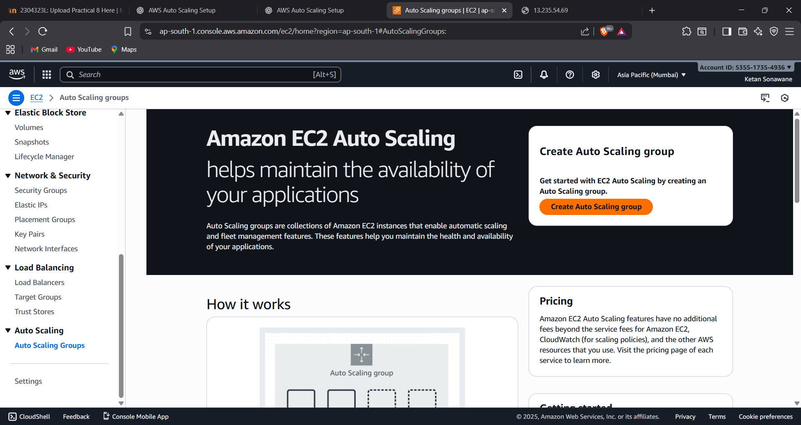
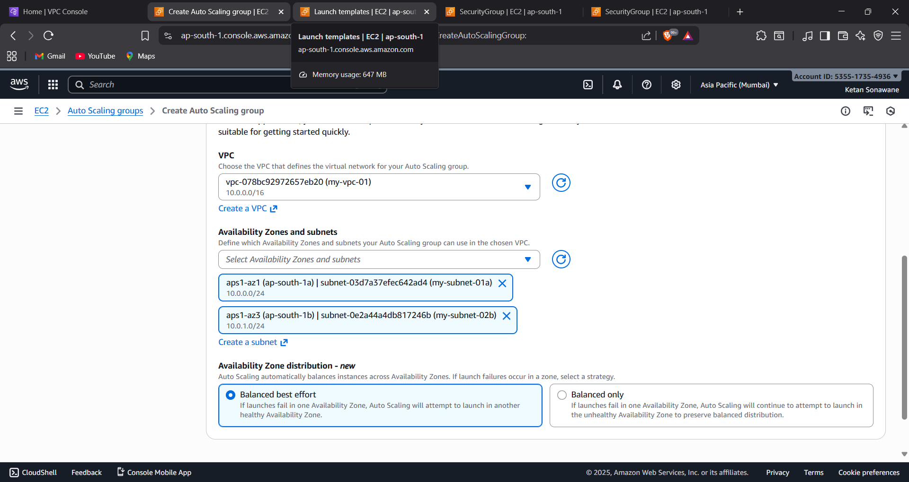
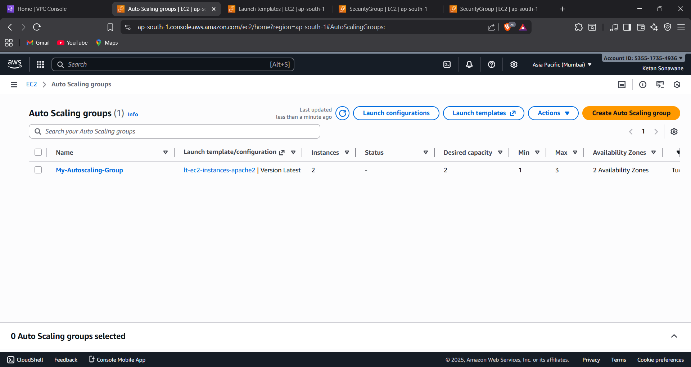
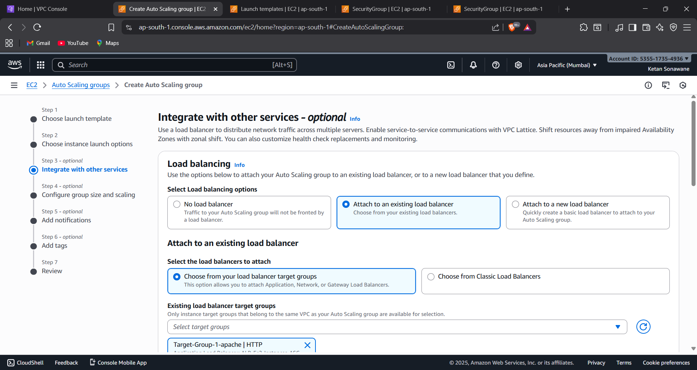

---

## Step 3: Application Load Balancer

Created ALB and Target Group:
- **ALB**: Internet-facing, spans multiple AZs
- **Target Group**: HTTP port 80
- **Health checks**: Every 30 seconds, 2 consecutive checks for healthy/unhealthy status
- Registered ASG with Target Group

**Purpose**: ALB distributes traffic evenly across healthy instances and provides a single DNS endpoint.

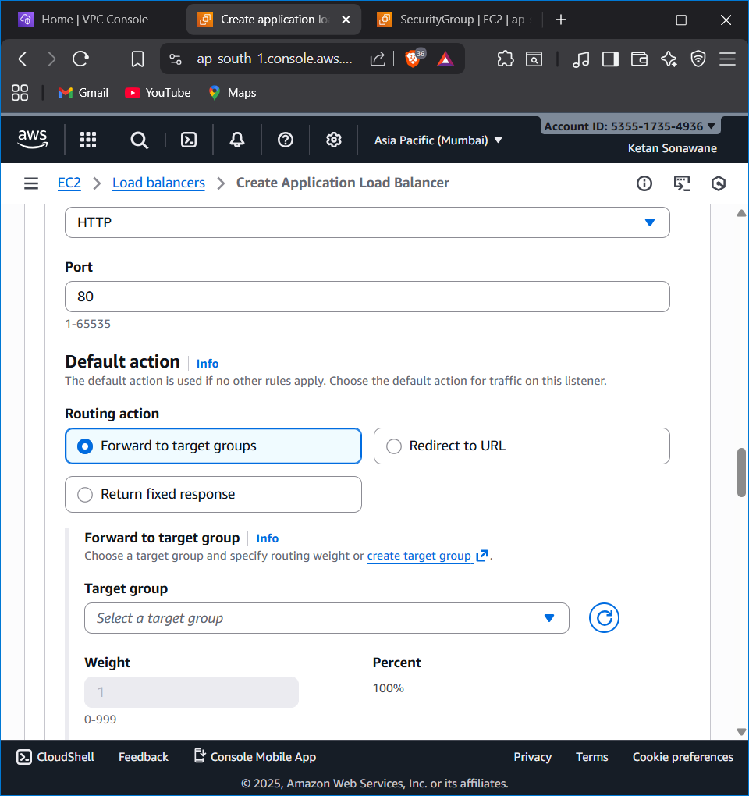
** Target Group Configuration ** :
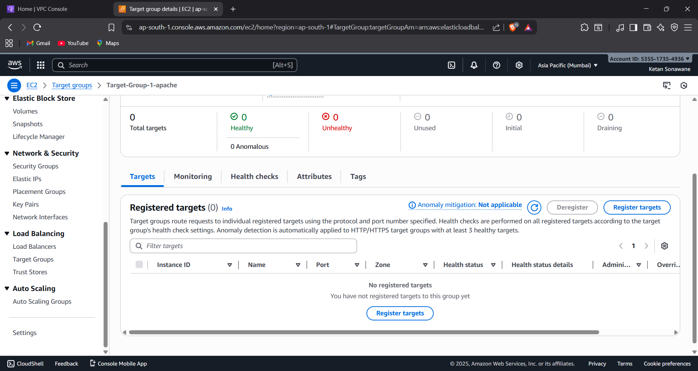
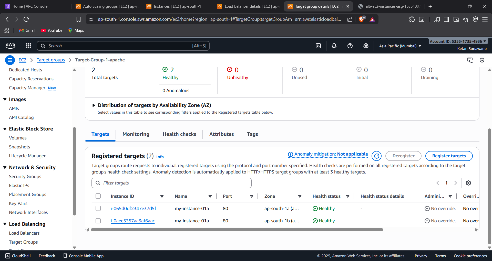


---

## Step 4: Scaling Policies

Implemented **Target Tracking Scaling** based on CPU:
- **Scale-Out**: CPU > 50% → Add 1 instance
- **Scale-In**: CPU < 20% → Remove 1 instance
- **Cool-down period**: 300 seconds

**Purpose**: Automatically adjusts capacity based on demand, optimizing both performance and cost.

---

## Step 5: Testing & Validation

### Load Balancer Test:
Accessed ALB DNS in browser to verify traffic distribution across instances.
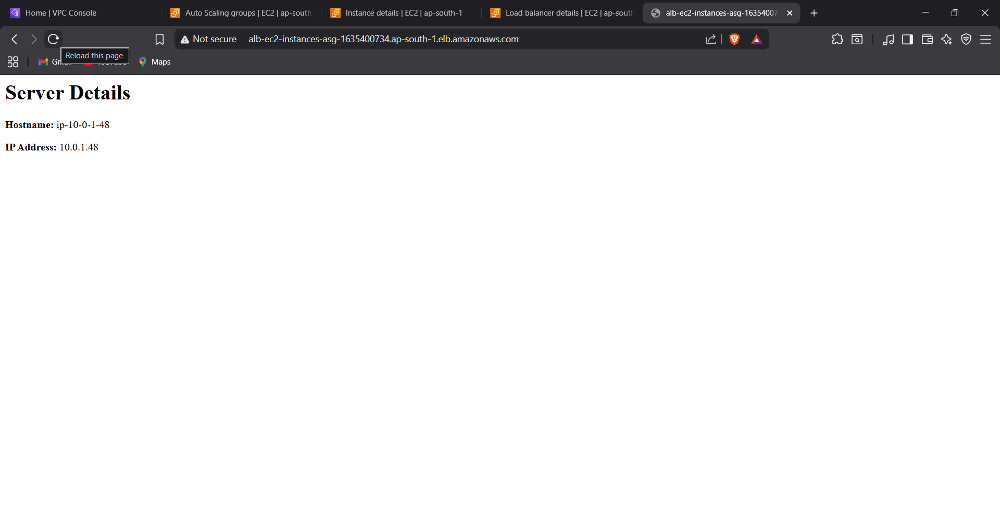
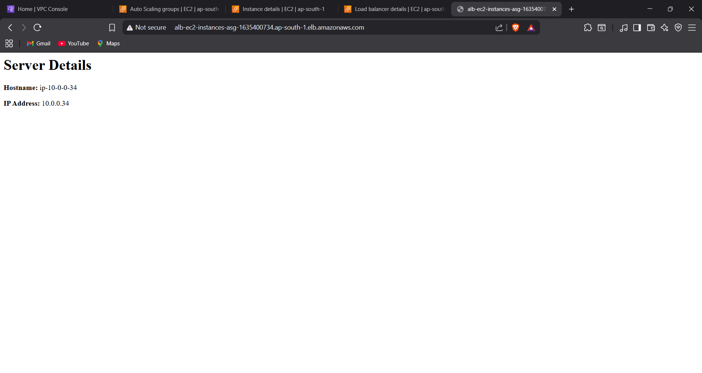
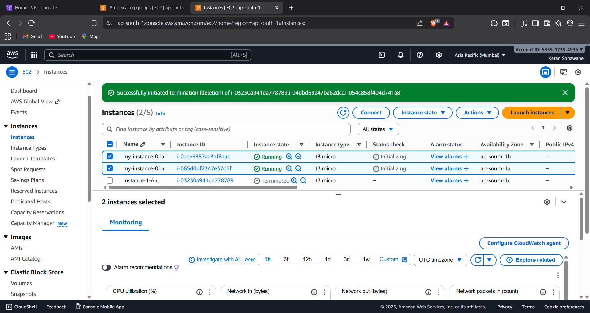

### Result :- 
When i use stress command it automatically auto-scaled the number of instances.
when th ecpu load is about to cross 50 %

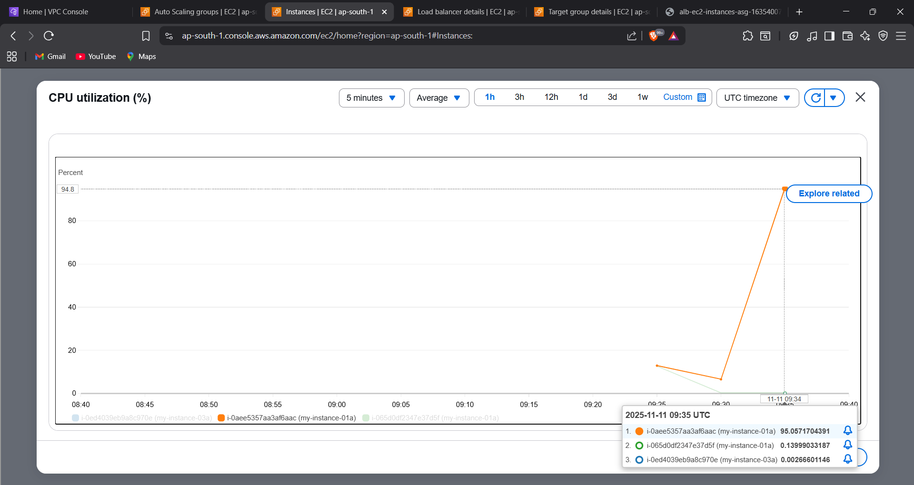
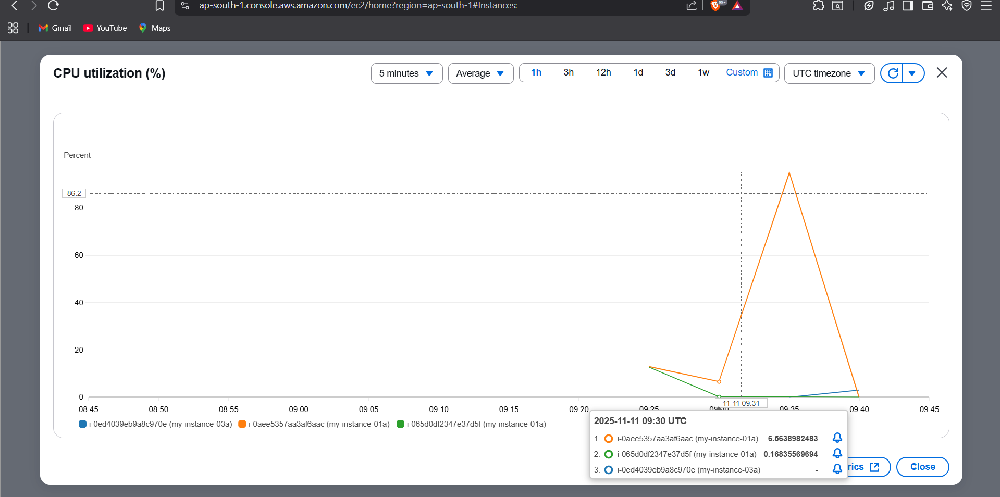
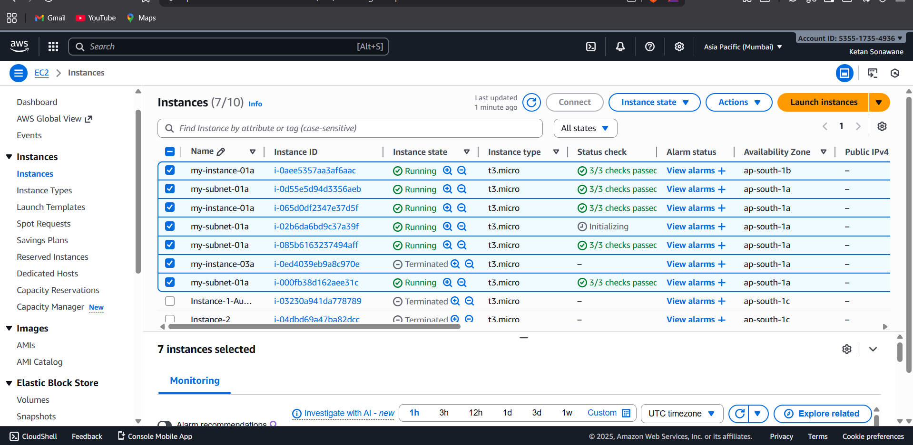


### Scale-Out Test:
```bash
# Install stress tool
sudo yum install stress -y

# Generate high CPU load for 5 minutes
stress --cpu 4 --timeout 300s
```

**Result**: CPU exceeded 50%, ASG launched additional instance (2→3 instances).


### Scale-In Test:
Stopped stress command, CPU dropped below 20%.
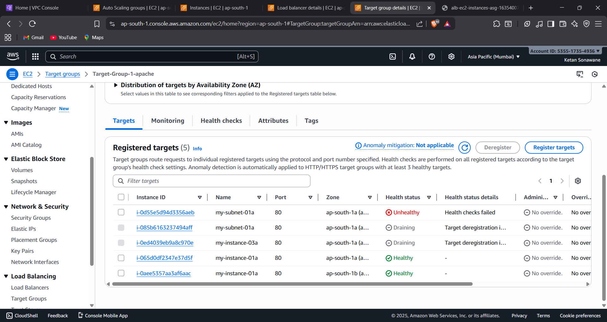

**Result**: After cool-down, ASG terminated extra instance (3→2 instances).

### Monitoring:
```bash
# Check CPU usage
top

# View system load
uptime
```

---

## Step 6: Cleanup

Deleted resources in order:
1. Auto Scaling Group (terminates all instances)
2. Launch Template
3. Load Balancer
4. Target Group
5. Custom Security Groups

**Important**: Always verify all resources are deleted to avoid unexpected AWS charges.

---

## Key Learnings

✅ **Auto Scaling**: Dynamically adjusts capacity based on CPU utilization  
✅ **High Availability**: Multi-AZ deployment prevents downtime  
✅ **Load Balancing**: Distributes traffic evenly and removes unhealthy instances  
✅ **Cost Optimization**: Scales down during low traffic to reduce costs  
✅ **Automatic Recovery**: Failed instances are replaced automatically  

---

## Commands Reference

```bash
# Stress test
sudo yum install stress -y
stress --cpu 4 --timeout 300s

# Monitor CPU
top
uptime

# Test ALB
curl http://<ALB-DNS>
```

## Architecture

```
Internet → ALB → Target Group → ASG → EC2 Instances (Multi-AZ)
                                ↓
                         CloudWatch → Scaling Policies
```

---

**Date**: 11/11/2025  
**AWS Services**: EC2, Auto Scaling, ALB, CloudWatch  
**Purpose**: Learning cloud infrastructure automation and high availability

## Author: Ketan Sonawane
